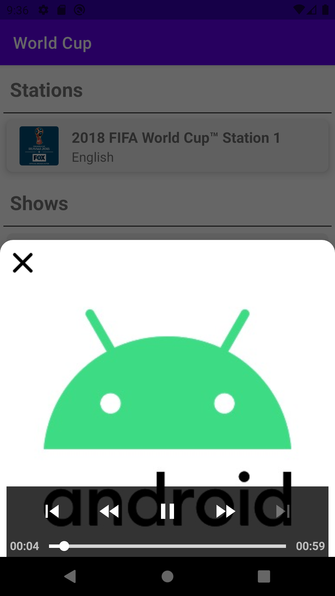

# FabFM RadioTime Hierarchy Traversal App

This is a native Android application written in Kotlin, using the Retrofit, RxJava, Moshi, and ExoPlayer libraries. It is written in the MVVM architecture pattern. 

| Browse | Play |
| --- | --- |
|  |  |

If I had more time, I would add Dagger or Hilt for dependency injection, but given the small size of the app, it didn't feel necessar to spend the time to do that. I would also update the styling, themes, and add animations for better transitions.

I was able to write some unit tests using JUnit, but would also include Espresso UI tests if time allowed.

Lastly, I spent a little time attempting to play audio files using ExoPlayer, but was unable to get m3u playlists working using the default setup for a simple ExoPlayer. If I had more time, I would dig into this issue further and find a workaround to play the media (such as the suggestion to use a custom MediaSource in https://github.com/google/ExoPlayer/issues/4066). In the meantime, I set up the app to play the Android exoplayer demo audio when an audio link is clicked.

| Browse | Play |
| --- | --- |
|  |  |